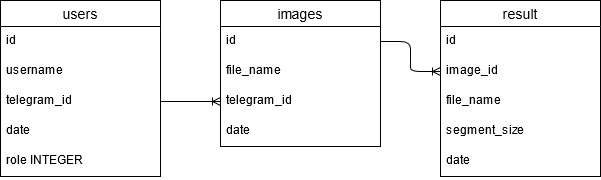

# This is Segmentation telegram bot

It use under the hood: slimbot, better-sqlite3

This is diagram of relational database used in this project



## How to install

1. Register new bot from BotFather

2. Create file `.env` and variable `BOT_TOKEN` to there

```
BOT_TOKEN=1234567890:Lalalalalalalal....
```

3. Install node dependensies

```
npm install
```

4. Uncomment `pathToPython` variable for your system in `server.js`

5. Install python virtual environment. 

```
cd python_env
python -m venv venv
```

6. Activate python virtual environmet

Windows:
```
.\venv\Scripts\activate
```
Linux:
```
source ./venv/bin/activate
```

7. Install python dependensies: `numpy` and `Pillow`

```
pip install -r req.txt
```

or

```
pip install numpy Pillow
```

8. Deactivate python virtual environmet

```
deactivate
```

9. Start telegram bot

```
node server.js
```
or use PM2 to demonise this telegram bot


## How to use

Just send to bot image as a file or if you using desktop version send file without compression. If you want change segment size add integer number from 2 to 100 inline to image.

You will get answer with segmented image.